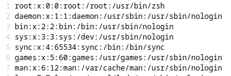
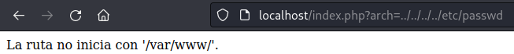
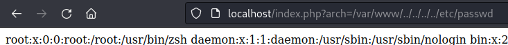

# Local File Inclusion
Un local file inclusion o inclusión de archivos locales es una vulnerabilidad que consiste en poder leer el contenido de archivos que se encuentran guardados en el servidor, esta vulnerabilidad es
causada debido a que los parametros que incluyen archivos a una web, no se encuentran bien validados y el atacante es capaz de manipular la ruta a la cual esta apuntado el 
parametro para conseguir leer archivos del servidor.

Por ejemplo, supon que encuentras una web con un login.php pero esta incluido de esta forma:


El codigo que se encarga de esto es el siguiente:
```php
<?php
$ruta = '/var/www/';
$archivo = $_GET['arch'];
$ruta .= $archivo;
require($ruta);
?>
```
Aqui el servidor se encarga de buscar el archivo que se encuentra especificado en el parametro 'arch' en la ruta /var/www/ en este caso el archivo es login.php, pero como el parametro no esta sanitizado, el atacante puede modificar el archivo y la ruta en la que el servidor incluira el archivo, de la siguiente forma:


Dando como resultado que el servidor incluya la ruta /var/www/../../../../etc/passwd y por lo tanto el archivo será mostrado en la web:



## LFI con secuencias de caracteres eliminas por el servidor

En ocaciones se trata de mitigar la vulnerabilidad LFI a traves de directorio cruzado eliminando los caracteres `../` antes de incluir el archvivo,
por ejemplo el siguiente codigo:
```php
<?php
$ruta = '/var/www/';
$archivo = $_GET['arch'];
$cadenaMaliciosa = '../'; 
$archivo = str_replace($cadenaMaliciosa,"",$archivo);
$ruta .= $archivo;
require($ruta);
?>
```
El codigo elimina la cadena `../` del posible input del usuario, entonces si el atacante ingresa la cadena `../../../etc/passwd` el 
archivo que sera buscado por el servidor sera `etc/passwd` que obviamente no existe.

En cambio si utilzamos la cadena `../..//etc/passwd` la cadena final será `/etc/passwd`.

Por lo tanto si la cadena a eliminar es literalmente `../` la cadena `....//` se convertira en `../` por lo que podemos crear la cadena `....//....//....//etc/passwd` para que se cumpla nuestro objetivo incial de crear el `../../../etc/passwd` sea cumplido.

## LFI mediante URL encoding
En algunas aplicaciones web cualquier caracter que tenga que ver con un directorio cruzado, en este caso la `/` y el `.` son eliminados antes de pasarlo a la aplicacción, en ocaciones podemos saltar el filtro enviando esos caracteres de forma codificada con el llamdado URL Encoding.

Entonces una cadena como `../../../etc/passwd` se puede representar de la forma `%2e%2e%2f%2e%2e%2f%2e%2e%2fetc%2fpasswd`

## LFI con una ruta inicial
Algunas veces la aplicación web valida la ruta en la que debe estar el archivo indicado los directorios donde estan todos los archivos de la aplicación, por ejemplo `/var/www/` aqui el codigo ejemplo:
``` php
<?php
$archivo = $_GET['arch'];
if (strpos($archivo, "/var/www/") === 0) {
        require($archivo);
} else {
    echo "La ruta no inicia con '/var/www/'.";
}
?>
```
En el codigo anterior solo se incluye el archivo si el parametro incia con `/var/www`


Si intentamos con el tipico `../../../etc/passwd`



Podemos saltar la restriccion de la siguiente forma `/var/www/../../../../etc/passwd`: 



##  LFI mediante null byte
En ocaciones la aplicación web valida que el archivo tenga cierta extensión, por ejemplo php, aqui el codigo de la aplicación:
```php
<?php
$archivo = $_GET['arch'];
if (pathinfo($archivo, PATHINFO_EXTENSION) === 'php') {
    require($archivo);
} else {
    echo "El archivo no tiene la extensión .php válida.";
}
?>
```
Una forma de bypass es agregar un null byte al parametro, es decir indicar que ahi se acaba la cadena y aun asi indicar la extensión:
`http://localhost/index.php?arch=../../../etc/passwd%00.php`

NOTA: Solo php version < 5.4
